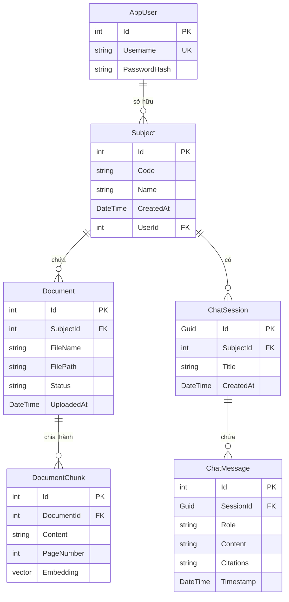

# Mô tả Entities trong dự án RagChatbot

## Tổng quan

Dự án sử dụng **Entity Framework Core** với **PostgreSQL** (có hỗ trợ extension `pgvector` cho vector search). Tất cả entity models nằm trong project `RagChatbot.DataAccess`, namespace `RagChatbot.DataAccess.EntityModels`.

Hệ thống gồm **6 entity** chính, phục vụ cho chức năng chatbot RAG (Retrieval-Augmented Generation):

| # | Entity | Mô tả | File |
|---|--------|--------|------|
| 1 | `AppUser` | Người dùng hệ thống | `EntityModels/AppUser.cs` |
| 2 | `Subject` | Môn học / Chủ đề | `EntityModels/Subject.cs` |
| 3 | `Document` | Tài liệu được upload | `EntityModels/Document.cs` |
| 4 | `DocumentChunk` | Đoạn văn bản đã được chia nhỏ + embedding | `EntityModels/DocumentChunk.cs` |
| 5 | `ChatSession` | Phiên hội thoại | `EntityModels/ChatSession.cs` |
| 6 | `ChatMessage` | Tin nhắn trong phiên hội thoại | `EntityModels/ChatMessage.cs` |

---

## Sơ đồ quan hệ (ER Diagram)



---

## Chi tiết từng Entity

### 1. AppUser

> Đại diện cho người dùng trong hệ thống. Mỗi user có thể sở hữu nhiều Subject.

**File:** [`AppUser.cs`](file:///d:/Education/ChatBotRag/RagChatbot.DataAccess/EntityModels/AppUser.cs)

| Property | Kiểu dữ liệu | Mô tả | Ràng buộc |
|----------|---------------|--------|-----------|
| `Id` | `int` | Khóa chính, tự tăng | PK |
| `Username` | `string` | Tên đăng nhập | **Unique Index** |
| `PasswordHash` | `string` | Mật khẩu đã mã hóa (SHA256, Base64) | Not null |

**Navigation Properties:**

| Property | Kiểu | Quan hệ |
|----------|-------|---------|
| `Subjects` | `ICollection<Subject>` | Một user có nhiều Subject |

**Constraints (cấu hình trong DbContext):**
- `Username` có **Unique Index** → không cho phép trùng tên đăng nhập.

**Seed Data:**
| Id | Username | Password (gốc) |
|----|----------|-----------------|
| 1 | `admin1` | `@Admin1` |
| 2 | `cus1` | `@Cus1` |
| 3 | `cus2` | `@Cus2` |

---

### 2. Subject

> Đại diện cho một môn học / chủ đề. Mỗi Subject thuộc về một User, chứa nhiều Document và nhiều ChatSession.

**File:** [`Subject.cs`](file:///d:/Education/ChatBotRag/RagChatbot.DataAccess/EntityModels/Subject.cs)

| Property | Kiểu dữ liệu | Mô tả | Ràng buộc |
|----------|---------------|--------|-----------|
| `Id` | `int` | Khóa chính, tự tăng | PK |
| `Code` | `string` | Mã môn học | Unique (kết hợp UserId) |
| `Name` | `string` | Tên môn học | Not null |
| `CreatedAt` | `DateTime` | Thời điểm tạo | Default: `DateTime.UtcNow` |
| `UserId` | `int` | FK tới `AppUser` | FK, Not null |

**Navigation Properties:**

| Property | Kiểu | Quan hệ |
|----------|-------|---------|
| `User` | `AppUser?` | Thuộc về một User |
| `Documents` | `ICollection<Document>` | Chứa nhiều Document |
| `ChatSessions` | `ICollection<ChatSession>` | Có nhiều ChatSession |

**Constraints (cấu hình trong DbContext):**
- **Composite Unique Index** trên `(Code, UserId)` → mỗi user không thể có 2 subject cùng mã.
- **Foreign Key** `UserId → AppUser.Id` với `OnDelete: Cascade` → khi xóa User, tất cả Subject liên quan bị xóa theo.

---

### 3. Document

> Đại diện cho một tài liệu được upload lên hệ thống. Tài liệu thuộc về một Subject và được chia thành nhiều DocumentChunk để phục vụ RAG.

**File:** [`Document.cs`](file:///d:/Education/ChatBotRag/RagChatbot.DataAccess/EntityModels/Document.cs)

| Property | Kiểu dữ liệu | Mô tả | Ràng buộc |
|----------|---------------|--------|-----------|
| `Id` | `int` | Khóa chính, tự tăng | PK |
| `SubjectId` | `int` | FK tới `Subject` | FK, Not null |
| `FileName` | `string` | Tên file gốc | Not null |
| `FilePath` | `string` | Đường dẫn lưu trữ file | Not null |
| `Status` | `string` | Trạng thái xử lý | Default: `"Pending"` |
| `UploadedAt` | `DateTime` | Thời điểm upload | Default: `DateTime.UtcNow` |

**Các giá trị của `Status`:**

| Giá trị | Ý nghĩa |
|---------|---------|
| `Pending` | Mới upload, chưa xử lý |
| `Processing` | Đang được xử lý (trích xuất text, tạo chunk, tạo embedding) |
| `Indexed` | Đã xử lý xong, sẵn sàng cho vector search |
| `Failed` | Xử lý thất bại |

**Navigation Properties:**

| Property | Kiểu | Quan hệ |
|----------|-------|---------|
| `Subject` | `Subject?` | Thuộc về một Subject |
| `DocumentChunks` | `ICollection<DocumentChunk>` | Chia thành nhiều chunk |

---

### 4. DocumentChunk

> Đại diện cho một đoạn văn bản được chia nhỏ từ Document, kèm theo vector embedding phục vụ cho vector similarity search (RAG).

**File:** [`DocumentChunk.cs`](file:///d:/Education/ChatBotRag/RagChatbot.DataAccess/EntityModels/DocumentChunk.cs)

| Property | Kiểu dữ liệu | Mô tả | Ràng buộc |
|----------|---------------|--------|-----------|
| `Id` | `int` | Khóa chính, tự tăng | PK |
| `DocumentId` | `int` | FK tới `Document` | FK, Not null |
| `Content` | `string` | Nội dung đoạn văn bản | Not null |
| `PageNumber` | `int?` | Số trang trong tài liệu gốc | Nullable |
| `Embedding` | `Vector?` | Vector embedding (pgvector) | Column type: `vector(768)` |

**Navigation Properties:**

| Property | Kiểu | Quan hệ |
|----------|-------|---------|
| `Document` | `Document?` | Thuộc về một Document |

**Ghi chú kỹ thuật:**
- Sử dụng thư viện `Pgvector` (NuGet package) cho kiểu dữ liệu `Vector`.
- Cột `Embedding` được map sang kiểu `vector(768)` trong PostgreSQL → embedding có **768 chiều** (dimensions).
- Đây là thành phần cốt lõi của hệ thống RAG: câu hỏi của user được chuyển thành embedding → so sánh cosine similarity với các chunk embedding → trả về các chunk liên quan nhất.

---

### 5. ChatSession

> Đại diện cho một phiên hội thoại giữa user và chatbot. Mỗi session gắn với một Subject cụ thể.

**File:** [`ChatSession.cs`](file:///d:/Education/ChatBotRag/RagChatbot.DataAccess/EntityModels/ChatSession.cs)

| Property | Kiểu dữ liệu | Mô tả | Ràng buộc |
|----------|---------------|--------|-----------|
| `Id` | `Guid` | Khóa chính (UUID) | PK, Default: `Guid.NewGuid()` |
| `SubjectId` | `int` | FK tới `Subject` | FK, Not null |
| `Title` | `string` | Tiêu đề phiên chat | Not null |
| `CreatedAt` | `DateTime` | Thời điểm tạo | Default: `DateTime.UtcNow` |

**Navigation Properties:**

| Property | Kiểu | Quan hệ |
|----------|-------|---------|
| `Subject` | `Subject?` | Thuộc về một Subject |
| `Messages` | `ICollection<ChatMessage>` | Chứa nhiều tin nhắn |

**Ghi chú:** Khóa chính sử dụng `Guid` thay vì `int` auto-increment, giúp tạo ID phía client mà không cần round-trip database.

---

### 6. ChatMessage

> Đại diện cho một tin nhắn trong phiên hội thoại. Có thể là tin nhắn của user hoặc phản hồi của assistant (chatbot).

**File:** [`ChatMessage.cs`](file:///d:/Education/ChatBotRag/RagChatbot.DataAccess/EntityModels/ChatMessage.cs)

| Property | Kiểu dữ liệu | Mô tả | Ràng buộc |
|----------|---------------|--------|-----------|
| `Id` | `int` | Khóa chính, tự tăng | PK |
| `SessionId` | `Guid` | FK tới `ChatSession` | FK, Not null |
| `Role` | `string` | Vai trò người gửi | Not null |
| `Content` | `string` | Nội dung tin nhắn | Not null |
| `Citations` | `string?` | Trích dẫn nguồn (JSON array) | Nullable |
| `Timestamp` | `DateTime` | Thời điểm gửi | Default: `DateTime.UtcNow` |

**Các giá trị của `Role`:**

| Giá trị | Ý nghĩa |
|---------|---------|
| `user` | Tin nhắn từ người dùng |
| `assistant` | Tin nhắn phản hồi từ chatbot |

**Navigation Properties:**

| Property | Kiểu | Quan hệ |
|----------|-------|---------|
| `Session` | `ChatSession?` | Thuộc về một ChatSession |

**Ghi chú:** `Citations` lưu dưới dạng JSON array string, chứa thông tin về các nguồn tài liệu mà chatbot đã tham khảo để tạo câu trả lời.

---

## Tổng hợp quan hệ giữa các Entity

| Quan hệ | Loại | FK | OnDelete |
|---------|------|-----|----------|
| `AppUser` → `Subject` | One-to-Many | `Subject.UserId` | Cascade |
| `Subject` → `Document` | One-to-Many | `Document.SubjectId` | (Default) |
| `Subject` → `ChatSession` | One-to-Many | `ChatSession.SubjectId` | (Default) |
| `Document` → `DocumentChunk` | One-to-Many | `DocumentChunk.DocumentId` | (Default) |
| `ChatSession` → `ChatMessage` | One-to-Many | `ChatMessage.SessionId` | (Default) |

---

## DTOs (Data Transfer Objects)

Các DTO nằm trong project `RagChatbot.Business`, namespace `RagChatbot.Business.DTOs`, dùng để truyền dữ liệu giữa tầng Business và Presentation.

| DTO | Mục đích | File |
|-----|----------|------|
| `SubjectDto` | Đọc thông tin Subject (kèm danh sách Documents) | `DTOs/SubjectDto.cs` |
| `CreateSubjectDto` | Tạo mới Subject | `DTOs/SubjectDto.cs` |
| `DocumentDto` | Đọc thông tin Document (kèm Subject & Chunks) | `DTOs/DocumentDto.cs` |
| `CreateDocumentDto` | Tạo mới Document | `DTOs/DocumentDto.cs` |
| `DocumentChunkDto` | Đọc thông tin Chunk | `DTOs/DocumentChunkDto.cs` |
| `ChatSessionDto` | Đọc thông tin ChatSession | `DTOs/ChatSessionDto.cs` |
| `CreateChatSessionDto` | Tạo mới ChatSession | `DTOs/ChatSessionDto.cs` |
| `ChatMessageDto` | Đọc thông tin ChatMessage | `DTOs/ChatMessageDto.cs` |
| `CreateChatMessageDto` | Tạo mới ChatMessage | `DTOs/ChatMessageDto.cs` |

---

## DbContext

**File:** [`ApplicationDbContext.cs`](file:///d:/Education/ChatBotRag/RagChatbot.DataAccess/Data/ApplicationDbContext.cs)

```csharp
public class ApplicationDbContext : DbContext
{
    public DbSet<Subject> Subjects { get; set; }
    public DbSet<Document> Documents { get; set; }
    public DbSet<DocumentChunk> DocumentChunks { get; set; }
    public DbSet<ChatSession> ChatSessions { get; set; }
    public DbSet<ChatMessage> ChatMessages { get; set; }
    public DbSet<AppUser> AppUsers { get; set; }
}
```

**Cấu hình đặc biệt trong `OnModelCreating`:**
- Kích hoạt PostgreSQL extension `vector` cho pgvector.
- Unique Index trên `AppUser.Username`.
- Composite Unique Index trên `(Subject.Code, Subject.UserId)`.
- Cascade delete từ `AppUser` → `Subject`.
- Map `DocumentChunk.Embedding` sang kiểu `vector(768)`.
- Seed 3 user mặc định (admin1, cus1, cus2).

---

## ViewModels

Các ViewModel nằm trong project `RagChatbot.Presentation`, namespace `RagChatbot.Presentation.ViewModels`. Chúng được dùng để truyền dữ liệu từ Controller sang View (Razor), đồng thời chứa các **validation rules** cho form input.

| #   | ViewModel                | Mục đích                              | File                              |
| -----| --------------------------| ---------------------------------------| -----------------------------------|
| 1   | `LoginViewModel`         | Form đăng nhập                        | `ViewModels/LoginViewModel.cs`    |
| 2   | `RegisterViewModel`      | Form đăng ký tài khoản                | `ViewModels/RegisterViewModel.cs` |
| 3   | `HomeIndexViewModel`     | Trang chủ (danh sách Subject)         | `ViewModels/HomeIndexViewModel.cs`|
| 4   | `DocumentIndexViewModel` | Trang quản lý tài liệu               | `ViewModels/DocumentIndexViewModel.cs` |
| 5   | `ErrorViewModel`         | Trang hiển thị lỗi                    | `ViewModels/ErrorViewModel.cs`    |

---

### 1. LoginViewModel

> Dùng cho form đăng nhập. Chứa validation bắt buộc cho username và password.

**File:** [`LoginViewModel.cs`](file:///d:/Education/ChatBotRag/RagChatbot.Presentation/ViewModels/LoginViewModel.cs)

| Property    | Kiểu dữ liệu | Mô tả                              | Validation                                  |
| -------------| --------------| ------------------------------------| ---------------------------------------------|
| `Username`  | `string`      | Tên đăng nhập                      | `[Required]` — "Tên đăng nhập là bắt buộc" |
| `Password`  | `string`      | Mật khẩu                           | `[Required]`, `[DataType(Password)]`        |
| `ReturnUrl` | `string?`     | URL redirect sau khi đăng nhập     | Nullable, không có validation               |

---

### 2. RegisterViewModel

> Dùng cho form đăng ký tài khoản mới. Có đầy đủ validation cho username, password và xác nhận mật khẩu.

**File:** [`RegisterViewModel.cs`](file:///d:/Education/ChatBotRag/RagChatbot.Presentation/ViewModels/RegisterViewModel.cs)

| Property          | Kiểu dữ liệu | Mô tả                  | Validation                                                                                       |
| -------------------| --------------| ------------------------| --------------------------------------------------------------------------------------------------|
| `Username`        | `string`      | Tên đăng nhập          | `[Required]`, `[StringLength(50, Min=3)]`, `[RegularExpression("^[a-zA-Z0-9_]*$")]`             |
| `Password`        | `string`      | Mật khẩu               | `[Required]`, `[StringLength(100, Min=6)]`, `[DataType(Password)]`                              |
| `ConfirmPassword` | `string`      | Xác nhận mật khẩu      | `[Required]`, `[DataType(Password)]`, `[Compare("Password")]`                                   |

**Chi tiết validation:**
- **Username**: 3–50 ký tự, chỉ chấp nhận chữ cái, số và dấu gạch dưới (`_`).
- **Password**: tối thiểu 6 ký tự, tối đa 100 ký tự.
- **ConfirmPassword**: phải khớp với `Password`.

---

### 3. HomeIndexViewModel

> Dùng cho trang chủ. Chứa danh sách các Subject của user hiện tại để hiển thị.

**File:** [`HomeIndexViewModel.cs`](file:///d:/Education/ChatBotRag/RagChatbot.Presentation/ViewModels/HomeIndexViewModel.cs)

| Property   | Kiểu dữ liệu              | Mô tả                     | Ghi chú         |
| ------------| ---------------------------| ---------------------------| -----------------|
| `Subjects` | `IEnumerable<SubjectDto>` | Danh sách Subject của user | Default: rỗng   |

**Ghi chú:** ViewModel này chỉ phục vụ hiển thị, không có validation.

---

### 4. DocumentIndexViewModel

> Dùng cho trang quản lý tài liệu. Chứa danh sách Document, danh sách Subject (cho dropdown lọc), và Subject đang được chọn.

**File:** [`DocumentIndexViewModel.cs`](file:///d:/Education/ChatBotRag/RagChatbot.Presentation/ViewModels/DocumentIndexViewModel.cs)

| Property                | Kiểu dữ liệu               | Mô tả                                 | Ghi chú          |
| -------------------------| ----------------------------| ----------------------------------------| ------------------|
| `Documents`             | `IEnumerable<DocumentDto>` | Danh sách tài liệu                    | Default: rỗng    |
| `Subjects`              | `IEnumerable<SubjectDto>`  | Danh sách Subject (cho dropdown lọc)   | Default: rỗng    |
| `LastSelectedSubjectId` | `int?`                      | ID Subject đang được chọn để lọc       | Nullable         |

**Ghi chú:** `LastSelectedSubjectId` giúp giữ lại trạng thái filter khi user quay lại trang — Subject nào đang được chọn sẽ được highlight trong dropdown.

---

### 5. ErrorViewModel

> Dùng cho trang hiển thị lỗi. Chứa Request ID để hỗ trợ debug.

**File:** [`ErrorViewModel.cs`](file:///d:/Education/ChatBotRag/RagChatbot.Presentation/ViewModels/ErrorViewModel.cs)

| Property        | Kiểu dữ liệu | Mô tả                               | Ghi chú                                      |
| -----------------| --------------| --------------------------------------| -----------------------------------------------|
| `RequestId`     | `string?`     | ID của request gây lỗi              | Nullable                                      |
| `ShowRequestId` | `bool`        | Có hiển thị RequestId hay không      | Computed: `!string.IsNullOrEmpty(RequestId)` |

**Ghi chú:** `ShowRequestId` là một **computed property** (không có setter), tự động trả `true` khi `RequestId` có giá trị.
